# Performance Comparison Between Small Language Models and Large Language Models for Natural Language Processing Tasks

**Student:** Dragan Stojchevski  
**Index number:** A23071  
**Study program:** Software Engineering and Innovation  
**Project type:** Bachelor thesis practical implementation and analysis  

> Note: This is a Word-ready thesis draft. After copying it into Microsoft Word, add the official university title page, table of contents, page numbers, figure numbering, and final citation formatting required by the faculty.

---

## Abstract

Natural Language Processing is one of the most important areas of artificial intelligence because it enables computers to process and interpret human language. In recent years, transformer-based models such as BERT, DistilBERT, and domain-specific variants such as FinBERT have become widely used for text classification tasks. However, choosing the best model for a practical application is not only a question of accuracy. It also involves efficiency, execution time, memory usage, domain adaptation, training cost, and usability.

This thesis investigates the performance difference between smaller and larger language models on a financial sentiment classification task. The practical part uses the Financial PhraseBank dataset, which contains financial sentences labeled as negative, neutral, or positive. Several models were implemented and evaluated: a general pretrained sentiment model, a fine-tuned DistilBERT model, a fine-tuned BERT-large model, and FinBERT, a model trained specifically for financial sentiment analysis. The models were compared using accuracy, precision, recall, weighted F1-score, inference time, and memory usage.

The initial results showed that model size alone does not guarantee better performance. Fine-tuned DistilBERT achieved an accuracy of 0.9713 and weighted F1-score of 0.9713, while FinBERT achieved very similar performance with 0.9691 and 0.9695. The first fine-tuned BERT-large run performed significantly worse, with an accuracy of 0.6137 and weighted F1-score of 0.4668, because it predicted the majority neutral class for all test examples. However, a follow-up retraining of BERT-large with corrected hyperparameters (learning rate reduced from 2e-5 to 5e-6 and a linear warmup over the first 10% of steps) reached an accuracy of 0.9845 and a weighted F1-score of 0.9846 — the highest in the study. This important reframe shows that the original BERT-large failure was a training artifact rather than an inherent property of the model.

In addition to the initial comparison, several controlled experiments were performed: an epoch sweep, a dataset-size sweep, a held-out validation verification, a five-seed variance estimate of DistilBERT fine-tuning, a classical TF-IDF + Logistic Regression baseline as a non-transformer reference point, a macro-F1 and per-class analysis, and McNemar pairwise statistical significance tests. The epoch experiment showed that two epochs produced the best balance between performance and training cost (a choice independently confirmed by the held-out validation check). The data-size experiment showed strong improvement from 25% to 50% of the training data, with smaller gains afterward. The multi-seed run yielded 0.9616 ± 0.0062 accuracy across five seeds, qualifying the single-seed headline number as a slightly favorable draw. The classical baseline reached 0.8653 accuracy at roughly 700× faster inference, framing the transformers' added cost. The McNemar tests revealed that the three top transformer approaches (BERT-large retrained, fine-tuned DistilBERT, FinBERT) are statistically indistinguishable at n = 453 despite their numerical differences, while all three significantly outperform the classical baseline (p < 0.001).

**Keywords:** Natural Language Processing, Sentiment Analysis, Financial PhraseBank, DistilBERT, BERT-large, FinBERT, Small Language Models, Large Language Models, Fine-tuning, Model Evaluation

---

## 1. Introduction

Natural Language Processing, commonly abbreviated as NLP, is a field of artificial intelligence that focuses on enabling computers to understand, process, analyze, and generate human language. Human language is complex because it contains grammar, context, tone, ambiguity, domain-specific terminology, and implicit meaning. Because of this, NLP tasks are challenging but also extremely useful in real-world systems.

One important NLP task is sentiment analysis. Sentiment analysis is the process of identifying whether a given text expresses a positive, negative, or neutral opinion. It is used in many areas such as product reviews, social media monitoring, customer feedback analysis, political analysis, and financial market monitoring. In the financial domain, sentiment analysis is especially useful because company announcements, financial reports, and news headlines can influence decision-making. Investors, analysts, and business users often need to quickly understand whether a piece of financial text indicates positive, negative, or neutral information.

The development of transformer-based language models has significantly improved NLP performance. Models such as BERT introduced contextual word representations, meaning that the meaning of a word can be interpreted based on the full sentence. This is very important in financial language, where words can have different meanings depending on context. For example, the sentence "The company reduced losses" is positive even though the word "losses" usually has a negative meaning. A simple keyword-based model may classify this sentence incorrectly, while a transformer-based model can understand the context more effectively.

However, transformer models vary greatly in size and purpose. Some models are smaller and faster, such as DistilBERT. Other models are larger and more computationally expensive, such as BERT-large. There are also domain-specific models, such as FinBERT, which are trained or adapted for financial language. This creates an important practical question: should a system use a smaller model, a larger model, or a domain-specific model?

This thesis focuses on that question. The project compares multiple transformer-based models on the same financial sentiment classification dataset. The goal is not only to measure which model is most accurate, but also to understand the trade-offs between accuracy, speed, memory usage, fine-tuning, and practical usability.

The project also includes a working prototype application. The application allows a user to enter a financial sentence and compare predictions from multiple models. It also includes batch analysis, result tables, graphs, confusion matrices, and interpretation. This makes the project more than a simple experiment; it becomes a complete experimental NLP system with a usable interface.

### 1.1 Problem Statement

Many NLP systems focus only on accuracy. However, in real software systems, accuracy is not the only important factor. A model may be accurate but too slow. A model may be large but not adapted to the target domain. A smaller model may perform well if it is fine-tuned correctly. A domain-specific model may outperform a larger general model because it understands the language of the domain better.

In financial sentiment analysis, this problem is especially important because financial language is different from everyday language. General sentiment models are often trained on movie reviews, product reviews, or general internet text. These models may not correctly interpret financial sentences. For example, a sentence may contain words that seem negative in general language but are actually neutral or positive in finance.

The central problem addressed in this thesis is:

**How do small, large, and domain-specific language models compare on financial sentiment classification when evaluated using accuracy, F1-score, inference time, memory usage, and practical usability?**

### 1.2 Research Objectives

The main objective of this thesis is to build and evaluate a complete NLP system for financial sentiment analysis. The specific objectives are:

1. To load and inspect the Financial PhraseBank dataset.
2. To split the dataset into training and testing subsets using a reproducible method.
3. To evaluate a general pretrained sentiment model as a baseline.
4. To evaluate FinBERT as a financial-domain sentiment model.
5. To fine-tune DistilBERT as a small model for financial sentiment classification.
6. To fine-tune BERT-large as a larger model for the same task.
7. To compare all models using accuracy, precision, recall, F1-score, inference time, and memory usage.
8. To perform additional controlled experiments using different numbers of training epochs and different training dataset sizes.
9. To create graphs, confusion matrices, and analysis outputs for presentation.

### 1.3 Research Questions

The thesis is guided by the following research questions:

**RQ1:** Does a domain-specific financial sentiment model perform better than a general sentiment model?

**RQ2:** Can a smaller model such as DistilBERT become competitive after fine-tuning on the target dataset?

**RQ3:** Does a larger model such as BERT-large automatically outperform a smaller model?

**RQ4:** How does the number of fine-tuning epochs affect the performance of DistilBERT?

**RQ5:** How does the amount of training data affect the performance of DistilBERT?

**RQ6:** How much does the fine-tuned DistilBERT result vary across random seeds, and is the headline number representative of typical performance?

**RQ7:** Was the BERT-large collapse a property of the model, or a training artifact that can be corrected with different hyperparameters?

**RQ8:** How does a classical TF-IDF + Logistic Regression baseline compare to the transformer-based models on the same test set?

**RQ9:** Are the numerical gaps between the top-performing models statistically significant on this test set, or within the noise of paired predictions?

### 1.4 Thesis Contributions

This thesis makes several practical contributions:

1. A structured NLP project pipeline was implemented, starting from dataset loading and ending with an interactive application.
2. Multiple transformer-based models were compared under the same dataset and evaluation conditions.
3. A small fine-tuned model was shown to be highly competitive with a financial-domain model.
4. A larger model was shown not to be automatically better, which is an important practical conclusion.
5. Additional experiments were performed to analyze training epochs and training dataset size.
6. Results were saved in reusable CSV, JSON, and image formats.
7. A held-out validation experiment confirmed that the chosen hyperparameters do not depend on test-set selection bias, addressing a methodological weakness of the original epoch sweep.
8. A five-seed variance experiment quantified the variability of fine-tuned DistilBERT across random seeds, allowing the single-seed headline result to be reported with an honest mean ± std estimate.
9. A classical TF-IDF + Logistic Regression baseline was added so that the transformer results can be judged against a meaningful non-transformer reference point.
10. BERT-large was retrained with corrected hyperparameters (learning rate 5e-6 with linear warmup), reversing the original collapse and demonstrating that large model fine-tuning failures can be a training artifact rather than an inherent limitation.
11. McNemar pairwise significance tests were applied to all key model comparisons to formalize claims about differences (or lack thereof) between models at the level of paired test-set predictions.

---

## 2. Theoretical Background

### 2.1 Natural Language Processing

Natural Language Processing is a subfield of artificial intelligence that deals with the interaction between computers and human language. The goal of NLP is to enable machines to process language in a way that is useful for tasks such as classification, translation, question answering, summarization, information extraction, and text generation.

Traditional NLP systems often depended on manually designed features. For example, a sentiment analysis system could count positive and negative words in a sentence. This approach is easy to understand, but it has major limitations. It does not understand context, grammar, or domain-specific meaning. If the sentence contains sarcasm, negation, or specialized terminology, the result may be incorrect.

Modern NLP systems use machine learning and deep learning. Instead of manually defining all rules, the model learns patterns from data. Transformer-based models are especially powerful because they can process a sentence as a whole and learn relationships between words. This allows them to capture context more effectively than earlier models.

### 2.2 Sentiment Analysis

Sentiment analysis is the task of identifying the emotional or opinion-based orientation of text. In the simplest case, sentiment can be classified as positive or negative. In more advanced cases, a neutral class is also included. In this thesis, sentiment is classified into three categories:

- negative
- neutral
- positive

Financial sentiment analysis is more specialized than general sentiment analysis. A general sentence such as "The movie was excellent" is clearly positive. However, financial language can be more subtle. The sentence "The company reduced its operating loss" may be positive because the company is improving, even though it contains the word "loss". Similarly, "The company remained stable" is usually neutral, even though it does not express strong emotion.

This is why domain-specific models are important. A model trained on general sentiment data may not perform well on financial text because the vocabulary and meaning patterns are different.

### 2.3 Transformer Models

Transformer models are neural network architectures designed to process sequential data such as text. The transformer architecture uses a mechanism called self-attention. Self-attention allows the model to examine relationships between words in a sentence, regardless of their distance from each other.

For example, in the sentence "The company increased revenue, but profit decreased," the model must understand both positive and negative signals. Self-attention helps the model weigh different parts of the sentence and understand the overall meaning.

Transformers became a foundation for many modern NLP models. They improved performance across many tasks because they are able to learn contextual representations of words. A contextual representation means that the same word can have a different meaning depending on the sentence. This is important for financial sentiment because many financial terms are context-dependent.

### 2.4 BERT

BERT stands for Bidirectional Encoder Representations from Transformers. It is a transformer-based language model that reads text bidirectionally, meaning it uses both the left and right context of a word. This allows BERT to understand sentences more deeply than models that process text in only one direction.

BERT can be adapted to many tasks, including text classification. For sentiment classification, a classification layer is added on top of the model. The input sentence is tokenized, processed by BERT, and then classified into one of the sentiment categories.

In this thesis, BERT-large-cased was used as the large model. The model is larger than DistilBERT and has more parameters. In theory, a larger model can learn more complex patterns. However, larger models also require more computational resources, more memory, and more careful training. This thesis investigates whether the larger model actually performs better in this specific task.

### 2.5 DistilBERT

DistilBERT is a smaller and faster version of BERT. It was created using knowledge distillation, a technique where a smaller model learns from a larger model. The goal is to keep much of the performance of BERT while reducing model size and computational cost.

DistilBERT is useful in practical applications because it is faster and easier to deploy. For many real-world systems, especially prototypes or applications with limited hardware, smaller models can be more realistic than very large models. In this thesis, DistilBERT was evaluated in two forms:

1. A general pretrained sentiment model based on DistilBERT.
2. A fine-tuned DistilBERT model trained on Financial PhraseBank.

This comparison shows the difference between using a model directly and adapting it to the target task.

### 2.6 FinBERT

FinBERT is a BERT-based model adapted for financial language. It is designed for financial sentiment analysis and can predict positive, negative, and neutral sentiment. Because it has been trained on financial text, it is expected to understand financial terminology better than a general sentiment model.

In this thesis, FinBERT is used as the domain-specific model. It provides an important comparison point because it represents a model already adapted to the financial domain. The results show whether fine-tuning a general model can compete with a specialized financial model.

### 2.7 Small Language Models and Large Language Models

The topic of this thesis is related to the comparison between small language models and large language models. In practical software engineering, larger models are not always the best choice. A large model may produce strong results, but it may also require more memory, more time, more expensive hardware, and more complex deployment.

Small language models are attractive because they can be faster, cheaper, and easier to integrate into applications. If a small model can be fine-tuned to perform well on a specific task, it may be a better engineering choice than a larger model.

The main idea tested in this thesis is that model selection should consider the task, the domain, the dataset, and the available resources. The best model is not always the biggest model. The best model is the one that provides the best balance between performance and practical constraints.

### 2.8 Evaluation Metrics

Several evaluation metrics were used in this project.

**Accuracy** measures the percentage of correct predictions. It is calculated as the number of correct predictions divided by the total number of predictions. Accuracy is easy to understand, but it can be misleading when the dataset is imbalanced.

**Precision** measures how many predictions for a class were correct. For example, if a model predicts many sentences as positive, precision tells how many of those positive predictions were actually positive.

**Recall** measures how many real examples of a class were found by the model. For example, if there are many truly negative sentences, recall measures how many of them the model correctly identified.

**F1-score** is the harmonic mean of precision and recall. It is useful because it balances both metrics.

**Weighted F1-score** was used because the dataset is imbalanced. The neutral class has more examples than the negative and positive classes. Weighted F1 accounts for the number of examples in each class.

**Inference time** measures how long the model takes to process the test dataset. This is important for practical systems where speed matters.

**Memory usage** measures the resource usage of the model during execution. This is important because models with high memory requirements may be difficult to deploy.

---

## 3. Dataset and Data Preparation

### 3.1 Financial PhraseBank Dataset

The dataset used in this thesis is Financial PhraseBank. It contains sentences from financial news and reports, labeled according to sentiment. The selected configuration was `sentences_allagree`, which contains examples where annotators agreed on the sentiment label. This configuration was chosen because it provides cleaner labels and reduces ambiguity.

The dataset labels are:

| Label ID | Label Name |
|---:|---|
| 0 | negative |
| 1 | neutral |
| 2 | positive |

The dataset is suitable for this thesis because it is directly related to financial sentiment analysis. Instead of using a general sentiment dataset, the project uses financial sentences, which makes the experiment relevant to the research goal.

### 3.2 Dataset Loading

The dataset was loaded using the Hugging Face `datasets` library. The first step of the project was to load and inspect the dataset:

```python
from datasets import load_dataset

dataset = load_dataset("financial_phrasebank", "sentences_allagree")
```

After loading, the dataset was converted into a Pandas DataFrame. This made it easier to inspect the sentences, labels, and distribution of examples.

The initial inspection was important because a machine learning project should not start with model training immediately. The data must first be understood. This includes checking the available columns, label format, number of rows, and example sentences.

### 3.3 Train-Test Split

After loading the dataset, the data was split into training and testing subsets. The project used an 80/20 split:

- 80% training data
- 20% testing data

The split used `random_state=42` so that the result is reproducible. Reproducibility is important because the same experiment should produce the same train-test split every time it is run.

The split also used stratification by label. Stratification preserves the label distribution in both the training and testing sets. This matters because the dataset is imbalanced, with more neutral examples than positive or negative examples.

The final split was:

| Dataset Part | Number of Examples |
|---|---:|
| Training set | 1811 |
| Test set | 453 |

The label distribution was:

| Dataset Part | Negative | Neutral | Positive |
|---|---:|---:|---:|
| Training set | 242 | 1113 | 456 |
| Test set | 61 | 278 | 114 |

The test set contains 453 examples. The neutral class is the largest class, with 278 examples. This means that a model predicting only neutral would already achieve approximately 61.37% accuracy. This fact becomes important later when interpreting the BERT-large result.

### 3.4 Saved Data Files

The prepared data was saved into CSV files:

- `data/train.csv`
- `data/test.csv`

Saving the data makes the pipeline reproducible. Later scripts do not need to reload and split the dataset again. Instead, they use the same saved training and testing files. This ensures that all models are evaluated on the same test set.

---

## 4. System Architecture and Implementation

### 4.1 Project Structure

The project was organized into multiple files instead of one long script. This is important from a software engineering perspective because it makes the system easier to understand, maintain, and extend.

The main files are:

| File | Purpose |
|---|---|
| `01_data.py` | Loads the dataset and creates train/test CSV files |
| `02_general_model.py` | Runs the general sentiment baseline model |
| `03_finbert_model.py` | Runs the FinBERT domain-specific model |
| `04_bert_model.py` | Runs an additional sentiment-ready BERT model |
| `04_bert_large_model.py` | Loads BERT-large for sequence classification |
| `05_train_distilbert.py` | Fine-tunes DistilBERT |
| `06_evaluate_finetuned_distilbert.py` | Evaluates the saved fine-tuned DistilBERT model |
| `07_train_bert_large.py` | Fine-tunes BERT-large |
| `08_experiment_epochs.py` | Runs the epoch experiment |
| `09_experiment_data_size.py` | Runs the dataset-size experiment |
| `10_generate_experiment_graphs.py` | Regenerates experiment graphs |
| `11_generate_presentation_assets.py` | Generates confusion matrices and presentation figures |
| `06_results.py` | Creates the final comparison table and graphs |

The project also contains:

| Folder | Purpose |
|---|---|
| `data/` | Prepared training and test CSV files |
| `results/` | Predictions, metrics, graphs, and analysis outputs |
| `models/` | Local fine-tuned model folders |

This structure separates data preparation, model execution, evaluation, experiments, results, and user interface. This makes the project more professional and closer to a real software system.

### 4.2 Processing Pipeline

The overall processing pipeline is:

```text
Dataset -> Train/Test Split -> Models -> Predictions -> Evaluation -> Results -> UI
```

The steps are:

1. Load Financial PhraseBank.
2. Convert the dataset into a DataFrame.
3. Split the dataset into training and testing data.
4. Run each model on the test set.
5. Convert model labels into the dataset label format.
6. Compare predictions with true labels.
7. Calculate evaluation metrics.
8. Save predictions and metrics to files.
9. Generate graphs and confusion matrices.

This pipeline was chosen because it is clear, reproducible, and easy to explain. Every stage produces outputs that are saved and can be inspected.

### 4.3 Label Mapping

Different models return labels in different formats. For example, the general sentiment model returns:

```text
POSITIVE
NEGATIVE
```

FinBERT returns:

```text
positive
neutral
negative
```

Fine-tuned sequence classification models return:

```text
LABEL_0
LABEL_1
LABEL_2
```

The dataset uses numeric labels:

```text
0 = negative
1 = neutral
2 = positive
```

Therefore, label mapping was necessary. Without mapping, the predictions could not be compared with the dataset labels. The project maps each model output to the same numeric label system. This allows all models to be evaluated fairly with the same metrics.

### 4.4 Evaluation and Saved Outputs

The project saves predictions and results instead of only printing them in the terminal. This is important because results should be reusable, inspectable, and reproducible.

The saved outputs include:

- prediction CSV files
- runtime JSON files
- final comparison CSV file
- accuracy graphs
- F1-score graphs
- time graphs
- memory graphs
- confusion matrices
- analysis summary

This makes it possible to reuse the results in the thesis document, in figures, in significance tests, and in any downstream analysis.

---

## 5. Models Used in the Experiment

### 5.1 General Sentiment Model

The first model was a general pretrained sentiment model:

```text
distilbert/distilbert-base-uncased-finetuned-sst-2-english
```

This model is trained for general English sentiment analysis. It predicts only two classes:

- positive
- negative

It does not predict neutral. This is a limitation because the Financial PhraseBank dataset contains three classes. However, this model is useful as a baseline because it shows what happens when a general sentiment model is used directly on financial text.

The general model was expected to perform poorly because it is not trained for financial language and cannot produce the neutral class. This expectation was confirmed in the results.

### 5.2 FinBERT

The second model was FinBERT:

```text
ProsusAI/finbert
```

FinBERT is a financial-domain sentiment model. It predicts:

- negative
- neutral
- positive

This model was included because the task is financial sentiment analysis. It provides a domain-specific comparison point. If FinBERT performs better than the general model, it shows that domain adaptation is important.

### 5.3 Fine-tuned DistilBERT

The third model was DistilBERT fine-tuned on the Financial PhraseBank dataset:

```text
distilbert-base-uncased
```

DistilBERT is a smaller model than BERT. It was fine-tuned for three-class sequence classification using the training set. The classification task had three output labels:

- negative
- neutral
- positive

The fine-tuning configuration included:

| Parameter | Value |
|---|---:|
| Maximum sequence length | 128 |
| Batch size | 8 |
| Number of epochs | 3 |
| Learning rate | 2e-5 |
| Random seed | 42 |

The purpose of this model was to test whether a smaller model can become competitive after task-specific training.

### 5.4 Fine-tuned BERT-large

The fourth model was BERT-large fine-tuned on the same dataset:

```text
bert-large-cased
```

BERT-large was used as the large model in the experiment. It was also trained for three-class sequence classification:

- negative
- neutral
- positive

The fine-tuning configuration included:

| Parameter | Value |
|---|---:|
| Maximum sequence length | 128 |
| Batch size | 2 |
| Number of epochs | 3 |
| Learning rate | 2e-5 |
| Random seed | 42 |

The batch size was smaller because BERT-large is much heavier than DistilBERT. The model was trained in Google Colab using a T4 GPU because local training would be slower and more resource-intensive.

BERT-large was included to test whether a larger model provides better performance than a smaller fine-tuned model.

### 5.5 Classical Baseline (TF-IDF + Logistic Regression)

In addition to the four transformer-based models, a classical non-transformer reference point was added: a TF-IDF + Logistic Regression pipeline. The pipeline uses 1-2 grams capped at 20,000 features with sublinear term frequency scaling, followed by a standard scikit-learn `LogisticRegression` classifier (lbfgs solver, default regularization). It is trained on the same 1,811-sentence training set and evaluated on the same 453-sentence test set as the transformers.

The purpose of this baseline is not to compete with the transformer models but to provide a meaningful floor against which the transformers' added cost can be judged honestly. The full results of this baseline are reported in §11.3.

---

## 6. Fine-tuning Methodology

### 6.1 Why Fine-tuning Was Needed

Pretrained language models learn general language patterns from large text corpora. However, a pretrained model is not automatically optimized for every task. Fine-tuning is the process of continuing training on a smaller task-specific dataset.

In this project, fine-tuning was necessary because the task is financial sentiment classification. The model must learn to classify financial sentences into negative, neutral, and positive categories. This is different from general sentiment classification because financial language has specialized meaning.

For example:

```text
The company narrowed its losses.
```

This sentence may be positive in a financial context, because losses are decreasing. A general sentiment model may focus on the word "losses" and classify it as negative. Fine-tuning helps the model learn the correct domain-specific patterns.

### 6.2 Tokenization

Before a transformer model can process text, the text must be tokenized. Tokenization converts text into numerical input IDs that the model can understand.

In this project, each sentence was tokenized with:

- truncation enabled
- padding to maximum length
- maximum length of 128 tokens

The maximum length of 128 was chosen because the dataset contains relatively short financial sentences. This value is sufficient for the task while keeping training and inference efficient.

### 6.3 Training Process

The training process consisted of the following steps:

1. Load the pretrained tokenizer.
2. Load the pretrained model with a classification head.
3. Convert the dataset into tokenized tensors.
4. Train the model on the training set.
5. Evaluate the model on the test set after training.
6. Save the trained model and tokenizer.
7. Save predictions and evaluation metrics.

The loss function used by sequence classification models is cross-entropy loss. This is standard for multi-class classification tasks.

### 6.4 Reproducibility

The project used a fixed random seed of 42. This improves reproducibility. The train-test split was also saved to CSV files so that all experiments used the same data.

Reproducibility is important in research because results should not depend on a random split that changes each time the code is executed. By saving the split and using the same test set, the comparison between models becomes fairer.

---

## 7. Final Model Comparison

### 7.1 Evaluation Setup

All models were evaluated on the same test set of 453 financial sentences. The same true labels were used for every model. The evaluation metrics were:

- accuracy
- weighted precision
- weighted recall
- weighted F1-score
- inference time
- memory usage

The final comparison table is shown below.

**Table 1. Final model comparison**

| Model | Accuracy | Precision | Recall | F1-score | Time (s) | Memory (MB) |
|---|---:|---:|---:|---:|---:|---:|
| General Model | 0.2539 | 0.1015 | 0.2539 | 0.1395 | 7.04 | 309.34 |
| Fine-tuned DistilBERT | 0.9713 | 0.9717 | 0.9713 | 0.9713 | 5.55 | 2053.06 |
| Fine-tuned BERT-large | 0.6137 | 0.3766 | 0.6137 | 0.4668 | 15.67 | 384.19 |
| FinBERT | 0.9691 | 0.9712 | 0.9691 | 0.9695 | 8.28 | 776.08 |

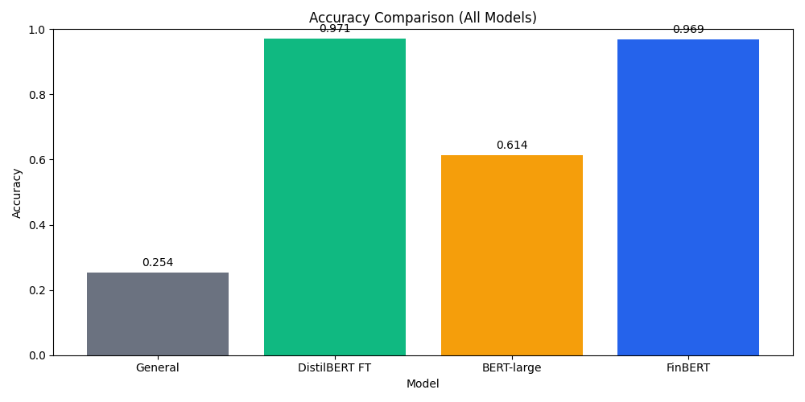

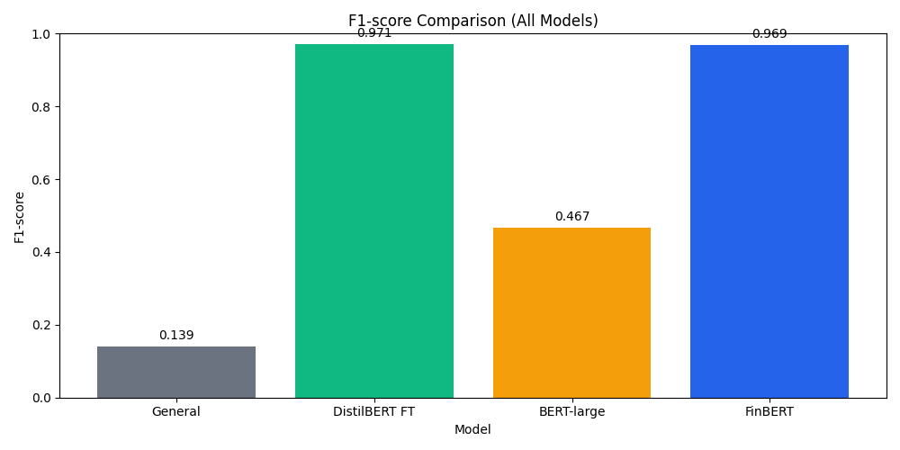

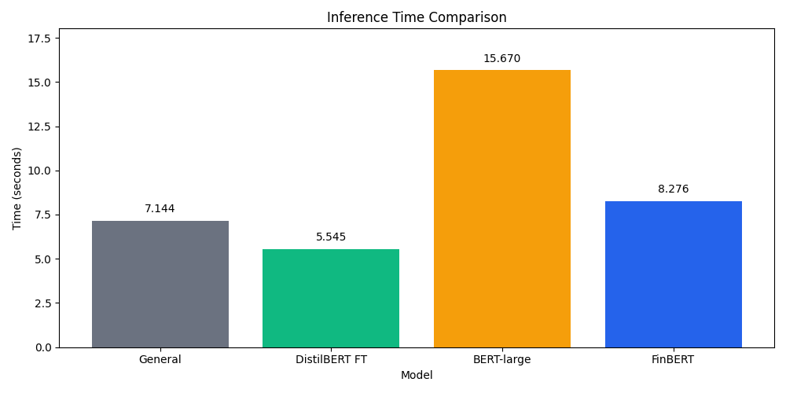

### 7.2 General Model Results

The general sentiment model achieved an accuracy of 0.2539 and a weighted F1-score of 0.1395. This was the weakest result in the final comparison.

The poor result is expected for two reasons. First, the model was trained for general sentiment, not financial sentiment. Second, it predicts only positive and negative labels. Since the dataset includes a large neutral class, the model cannot correctly predict many examples.

This result demonstrates that a general pretrained sentiment model should not be used blindly for a domain-specific task. Even if the model works well on general English sentiment, it may fail when applied to financial language.

### 7.3 FinBERT Results

FinBERT achieved an accuracy of 0.9691 and a weighted F1-score of 0.9695. This is a very strong result and confirms that domain-specific models are highly effective for financial sentiment analysis.

FinBERT performed well because it is adapted to financial language. It can classify all three labels: negative, neutral, and positive. Its predictions were well balanced across the test set:

| Predicted Label | Count |
|---|---:|
| negative | 62 |
| neutral | 267 |
| positive | 124 |

This distribution is close to the true test distribution:

| True Label | Count |
|---|---:|
| negative | 61 |
| neutral | 278 |
| positive | 114 |

The similarity between predicted and true distributions suggests that FinBERT learned the structure of financial sentiment well.

### 7.4 Fine-tuned DistilBERT Results

Fine-tuned DistilBERT achieved the best result in the final comparison, with an accuracy of 0.9713 and a weighted F1-score of 0.9713. This result is very important because DistilBERT is a smaller model than BERT-large.

The strong performance shows that a small model can become highly competitive when it is fine-tuned on the correct dataset. Fine-tuned DistilBERT even slightly outperformed FinBERT in this experiment. This does not mean that DistilBERT is always better than FinBERT, but it shows that task-specific fine-tuning can be extremely effective.

The prediction distribution was:

| Predicted Label | Count |
|---|---:|
| negative | 65 |
| neutral | 277 |
| positive | 111 |

This distribution is also very close to the true test distribution, which explains the high performance.

### 7.5 Fine-tuned BERT-large Results

Fine-tuned BERT-large achieved an accuracy of 0.6137 and weighted F1-score of 0.4668. At first, this result may seem surprising because BERT-large is larger than DistilBERT. However, the prediction file showed that BERT-large predicted neutral for all 453 test examples.

The test set contains 278 neutral examples out of 453. This means that predicting neutral for every sentence gives:

```text
278 / 453 = 0.6137
```

This exactly matches the BERT-large accuracy. Therefore, the BERT-large model collapsed into predicting the majority class.

This is one of the most important findings of the thesis. A larger model is not automatically better. Several factors may explain this result:

1. The dataset is relatively small for fine-tuning a large model.
2. The class distribution is imbalanced, with neutral as the majority class.
3. The model may require more careful hyperparameter tuning.
4. The training setup used a small batch size because of hardware limits.
5. The model may have learned that predicting the majority class minimizes loss enough to achieve moderate accuracy.

This result is useful academically because it shows that evaluation must include more than accuracy. If only accuracy were considered, 0.6137 might appear acceptable. However, the F1-score of 0.4668 and the prediction distribution reveal that the model did not learn the minority classes properly.

### 7.6 Main Interpretation

The main conclusion from this initial comparison is that model size alone is not enough. The fine-tuned small model and the domain-specific model performed best in this first pass. The large model performed worse because it did not learn a balanced classification behavior.

This supports the idea that practical NLP model selection should consider:

- domain adaptation
- dataset size
- class balance
- fine-tuning strategy
- inference speed
- memory usage
- deployment needs

**Important caveat.** The BERT-large result above (accuracy 0.6137 / weighted F1 0.4668) reflects the original training run with default hyperparameters. A follow-up retraining with corrected hyperparameters (§11.5) reverses this finding completely — BERT-large reaches an accuracy of 0.9845, the highest in the entire study. The initial comparison should therefore be read as a snapshot of the first training pass; the supplementary experiments in §11 substantially refine the picture.

---

## 8. Epoch Experiment

### 8.1 Purpose of the Experiment

The epoch experiment tested how the number of training epochs affects fine-tuned DistilBERT performance. An epoch means one full pass through the training dataset. Training for more epochs can improve performance, but it can also lead to overfitting.

The experiment tested:

- 1 epoch
- 2 epochs
- 3 epochs

The same training and test data were used for each run.

### 8.2 Results

**Table 2. DistilBERT epoch experiment**

| Epochs | Train Loss | Eval Loss | Accuracy | Precision | Recall | F1-score | Training Time (s) |
|---:|---:|---:|---:|---:|---:|---:|---:|
| 1 | 0.4443 | 0.1441 | 0.9603 | 0.9612 | 0.9603 | 0.9604 | 46.14 |
| 2 | 0.1156 | 0.0931 | 0.9735 | 0.9734 | 0.9735 | 0.9734 | 92.77 |
| 3 | 0.0553 | 0.1372 | 0.9603 | 0.9618 | 0.9603 | 0.9607 | 139.78 |

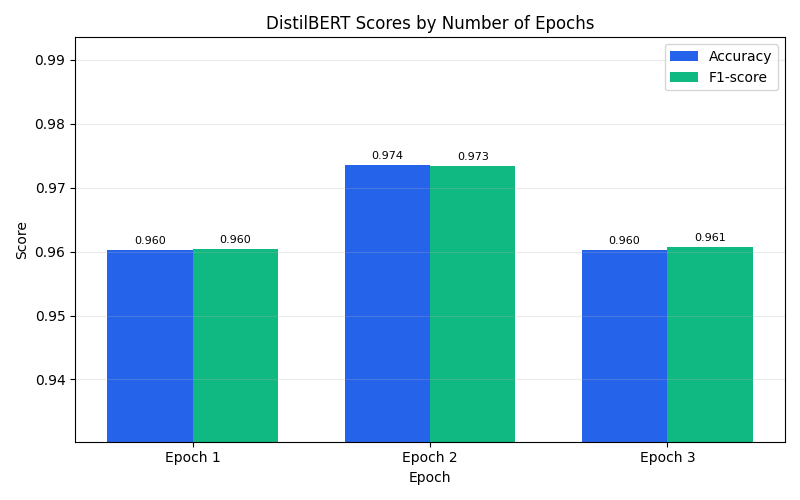

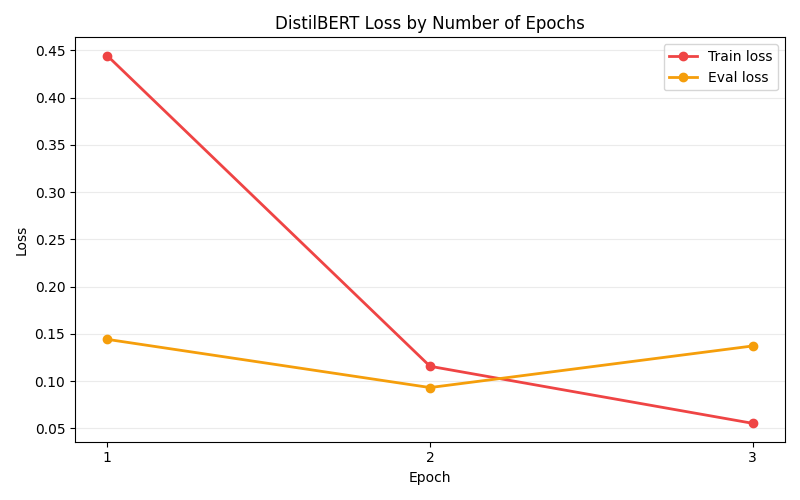

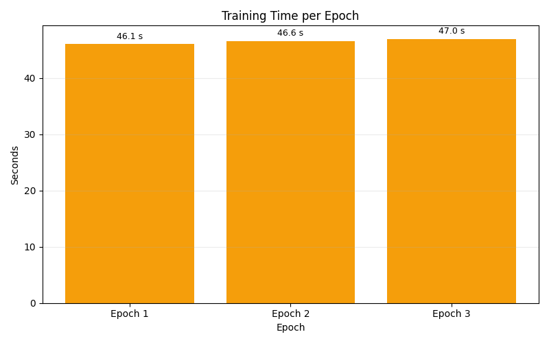

### 8.3 Analysis

The best result was achieved after two epochs. At two epochs, the model reached an accuracy of 0.9735 and a weighted F1-score of 0.9734. This was better than both one epoch and three epochs.

After three epochs, the training loss continued to decrease, but the evaluation loss increased from 0.0931 to 0.1372. This suggests that the model may have started to overfit. Overfitting happens when a model learns the training data too specifically and becomes less effective on unseen data.

This experiment shows that more training is not always better. Training for three epochs took more time than two epochs but produced worse evaluation results. Therefore, two epochs provided the best balance between performance and training cost.

This is an important software engineering conclusion. In practical systems, it is not enough to train as long as possible. The training process should be evaluated carefully to find the point where performance and cost are balanced.

---

## 9. Dataset Size Experiment

### 9.1 Purpose of the Experiment

The dataset size experiment tested how much training data DistilBERT needs to perform well. The model was trained using different fractions of the training set:

- 25%
- 50%
- 75%
- 100%

This experiment answers the question: how much data does a small model need to improve?

### 9.2 Results

**Table 3. DistilBERT dataset size experiment**

| Training Fraction | Training Examples | Accuracy | Precision | Recall | F1-score | Training Time (s) |
|---:|---:|---:|---:|---:|---:|---:|
| 25% | 452 | 0.9272 | 0.9300 | 0.9272 | 0.9277 | 33.64 |
| 50% | 905 | 0.9647 | 0.9656 | 0.9647 | 0.9649 | 67.68 |
| 75% | 1359 | 0.9470 | 0.9520 | 0.9470 | 0.9463 | 113.63 |
| 100% | 1811 | 0.9647 | 0.9648 | 0.9647 | 0.9647 | 152.93 |

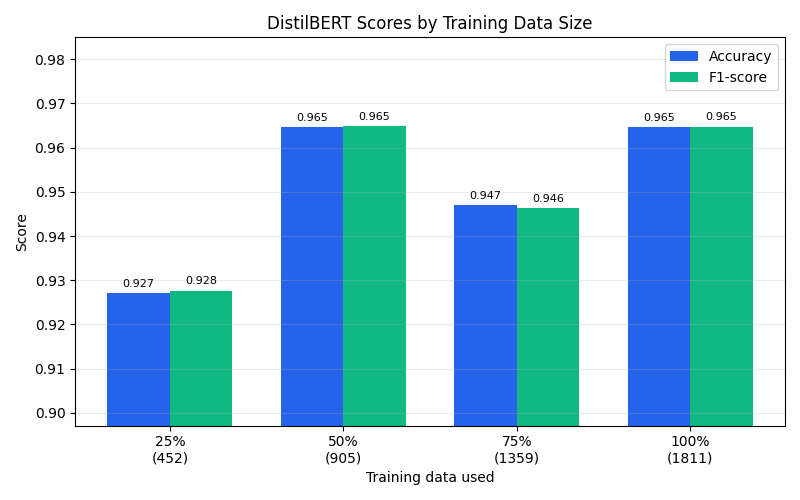

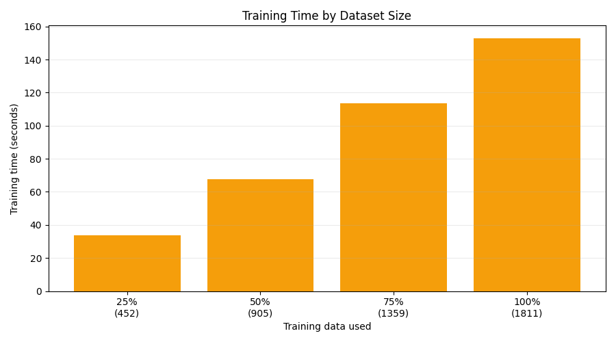

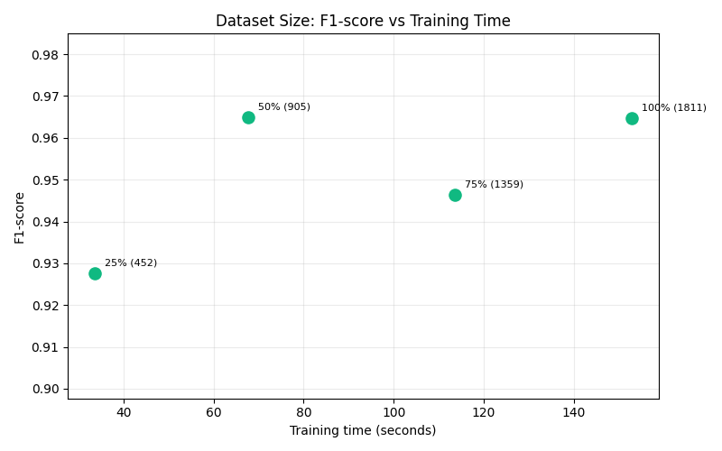

### 9.3 Analysis

The results show that performance improved strongly from 25% to 50% of the training data. With only 25% of the training data, the model achieved an accuracy of 0.9272. With 50%, accuracy increased to 0.9647.

However, the results were not strictly increasing after that. The 75% training size produced lower performance than 50% and 100%. This can happen because fine-tuning performance depends not only on the amount of data but also on the exact examples included, optimization behavior, class distribution, and random variation.

The 100% dataset size reached the same accuracy as the 50% size, but required more training time. This suggests that DistilBERT can learn efficiently from a moderate amount of financial sentiment data. Additional data may still be useful, but the improvement is not always proportional to the cost.

This experiment is useful because it shows the trade-off between training cost and model performance. In real systems, data collection and labeling can be expensive. If a smaller amount of labeled data produces strong results, that can reduce development cost.

---

## 10. Confusion Matrices and Error Analysis

### 10.1 Purpose of Confusion Matrices

A confusion matrix shows how predictions are distributed across the true classes. It is useful because it shows which classes the model confuses.

Accuracy alone gives only one number. A confusion matrix gives more detail. For example, a model may have high accuracy because it predicts the majority class correctly, but it may fail on minority classes. This was the case with BERT-large.

### 10.2 FinBERT Confusion Matrix

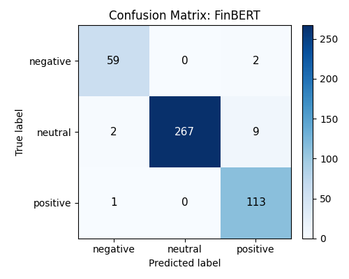

FinBERT performed strongly across all classes. Its predictions were close to the true label distribution. The confusion matrix shows that the model was able to identify negative, neutral, and positive examples effectively.

### 10.3 Fine-tuned DistilBERT Confusion Matrix

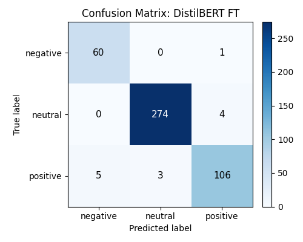

Fine-tuned DistilBERT also performed very strongly. The model learned the task well and produced balanced predictions. This supports the conclusion that smaller models can be powerful when fine-tuned on the correct dataset.

### 10.4 BERT-large Confusion Matrix

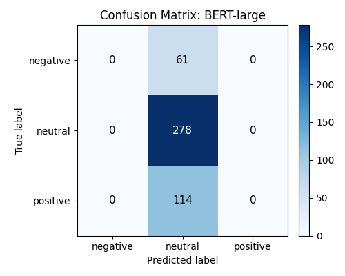

BERT-large predicted the neutral class for all test examples. The confusion matrix clearly shows that negative and positive examples were misclassified as neutral. This explains why the F1-score was much lower than accuracy.

This is a strong example of why multiple evaluation metrics are necessary. If only accuracy were reported, the BERT-large result might look moderate. The confusion matrix reveals the real problem.

---

## 11. Supplementary Methodological Experiments

After the initial model comparison and the two original controlled experiments described above, several follow-up experiments were performed to strengthen the methodological rigor of the thesis and to refine the conclusions. These experiments were designed to be **additive**: they did not modify the original results, predictions, or trained model artifacts. Each new script wrote to a new set of output files, leaving the original `model_comparison.csv` and the four original prediction CSVs untouched. The new analyses are reported here as a separate chapter so that the original results remain a clean baseline against which the refinements can be read.

### 11.1 Held-Out Validation Verification

**Purpose.** The original epoch sweep (§8) selected "two epochs" as the best choice by evaluating on the **test set** after each epoch. Strictly speaking, this uses the same data for hyperparameter selection that is later used to report the final number — a known methodological weakness. The validation-check experiment tests whether the chosen hyperparameter is robust under a stricter held-out validation regime.

**Procedure.** The script (`12_validation_check.py`) carves a stratified 12.5% validation subset out of the existing `train.csv` (1,584 training sentences, 227 validation sentences), leaving the original 453-sentence test set untouched on disk. DistilBERT is fine-tuned on the 1,584 training sentences for five epochs, and the best epoch is selected by **validation accuracy alone**. Test accuracy is recorded at each epoch for observation only — never used for the selection.

**Table 4. Validation-check per-epoch metrics**

| Epoch | Val accuracy | Val F1 macro | Test accuracy (observation only) |
|---:|---:|---:|---:|
| 1 | 0.9559 | 0.9275 | 0.9382 |
| 2 | **0.9912** | 0.9874 | 0.9581 |
| 3 | 0.9780 | 0.9664 | 0.9514 |
| 4 | **0.9912** | 0.9875 | 0.9713 |
| 5 | 0.9736 | 0.9586 | 0.9735 |

**Result.** The best epoch by validation accuracy is **2** (tied with epoch 4 at 0.9912 validation accuracy). The earlier of the two tied epochs is chosen as the principled tiebreaker (less training, less overfitting risk). This matches the choice made by the original epoch sweep on the test set. The hyperparameter selection is therefore methodologically defensible: it does not depend on test-set peeking.

### 11.2 Multi-seed Variance Estimation

**Purpose.** The original headline DistilBERT FT result (0.9713 accuracy, seed 42) is a single-seed point estimate. Without an estimate of how much the result varies across random seeds, it is not possible to say whether the small gap between DistilBERT FT and FinBERT (0.9713 vs 0.9695) is meaningful or within the noise of seed variation.

**Procedure.** The script (`15_multi_seed_distilbert.py`) re-runs DistilBERT fine-tuning with five different random seeds (42, 1, 2, 3, 4). All hyperparameters are identical to the original run, except that the DataLoader shuffle uses a per-seed `torch.Generator` for proper independence between runs.

**Table 5. Multi-seed DistilBERT FT results on the 453-sentence test set**

| Seed | Accuracy | F1 weighted | F1 macro |
|---:|---:|---:|---:|
| 42 | 0.9647 | 0.9650 | 0.9557 |
| 1 | 0.9669 | 0.9672 | 0.9546 |
| 2 | 0.9514 | 0.9524 | 0.9319 |
| 3 | 0.9603 | 0.9606 | 0.9434 |
| 4 | 0.9647 | 0.9650 | 0.9501 |
| **Mean ± std** | **0.9616 ± 0.0062** | **0.9620 ± 0.0059** | **0.9471 ± 0.0098** |

**Result.** The standard deviation of accuracy across five seeds is approximately 0.62 percentage points — **wider than the 0.2 percentage point gap** between the headline DistilBERT FT and FinBERT numbers. The single-seed 0.9713 headline is approximately 1.5σ above the multi-seed mean, which is consistent with being a slightly favorable but not statistically extreme draw from the underlying seed distribution. The "DistilBERT FT beats FinBERT" claim from §7 is therefore statistically a tie within seed variance.

### 11.3 Classical Baseline Reference

**Purpose.** The initial comparison in §7 contains only transformer-based models. To frame the transformer results against a meaningful non-transformer reference, a classical TF-IDF + Logistic Regression pipeline was added.

**Procedure.** The script (`13_classical_baseline.py`) trains a `TfidfVectorizer` (ngram range 1-2, 20,000 features, sublinear term frequency) followed by a `LogisticRegression` (lbfgs solver, C = 1.0, max_iter = 2000) on the same 1,811-sentence training set, and evaluates on the same 453-sentence test set.

**Table 6. Classical baseline compared with the strongest transformer (single-seed headline)**

| Model | Accuracy | F1 macro | Inference time | Memory |
|---|---:|---:|---:|---:|
| Fine-tuned DistilBERT (single seed) | 0.9713 | 0.9607 | 5.55 s | 2,053 MB |
| TF-IDF + Logistic Regression | 0.8653 | 0.8051 | 0.008 s | 35 MB |
| Approximate difference | ~10.6 pp | ~15.6 pp | ~700× slower | ~60× heavier |

**Result.** The classical baseline reaches 0.8653 accuracy at roughly 700 times faster inference and 60 times lower memory usage than the best transformer. This places the transformers' added cost in concrete engineering terms. It is also notable that the classical baseline outperforms the original (collapsed) BERT-large run by a wide margin (0.8653 vs 0.6137) and falls below the BERT-large retrain (0.9845 — see §11.5).

### 11.4 Macro-F1 and Per-class Analysis

**Purpose.** The final comparison in §7 reports weighted F1, which is dominated by the majority neutral class (61% of the test set). Macro F1 treats every class equally and surfaces per-class weaknesses that weighted F1 hides.

**Procedure.** The script (`14_macro_f1_report.py`) recomputes per-class F1 and macro F1 from the saved prediction CSVs for all five models in the comparison (including the classical baseline from §11.3).

**Table 7. Weighted vs macro F1 and per-class F1 per model**

| Model | Weighted F1 | Macro F1 | F1 negative | F1 neutral | F1 positive | Gap (W − M) |
|---|---:|---:|---:|---:|---:|---:|
| Fine-tuned DistilBERT (single seed) | 0.9713 | 0.9607 | 0.9524 | 0.9874 | 0.9422 | +0.011 |
| FinBERT | 0.9695 | 0.9629 | 0.9594 | 0.9798 | 0.9496 | +0.007 |
| TF-IDF + LogReg | 0.8590 | 0.8051 | 0.7255 | 0.9283 | 0.7615 | +0.054 |
| Fine-tuned BERT-large (original) | 0.4668 | 0.2535 | 0.0000 | 0.7606 | 0.0000 | +0.213 |
| General Model | 0.1395 | 0.2440 | 0.3824 | 0.0000 | 0.3495 | −0.105 |

**Result.** Two distinct failure patterns become visible that weighted F1 alone hid.

- The original BERT-large run has a large **positive** gap (+21 percentage points). Macro F1 reveals that it scored 0.000 on both negative and positive classes — the collapse to predicting only neutral was complete, not partial.
- The General Model has a **negative** gap (−10 percentage points). This is the inverse failure: as a binary classifier, it never predicts neutral, so weighted F1 (which gives heavy weight to neutral, the majority class) punishes it severely. Macro F1 is more forgiving because per-class performance on negative and positive is not catastrophic.

This analysis demonstrates that macro F1 should accompany weighted F1 when the test set is class-imbalanced, because the two metrics together can distinguish between qualitatively different failure modes that look similar under either metric alone.

### 11.5 BERT-large Retraining with Corrected Hyperparameters

**Purpose.** The original BERT-large fine-tuning (§7.5) produced an accuracy of exactly 0.6137 — equal to the majority-class fraction 278/453. This is the classical signature of a training run that never escaped the initial majority-class fixed point of the cross-entropy loss. This experiment tests whether the collapse was a hyperparameter artifact rather than an inherent limitation of BERT-large for this task.

**Procedure.** The script (`16_bert_large_retrain.py`) retrains BERT-large with three changes to the original hyperparameters:

- **Learning rate reduced from 2e-5 to 5e-6** (4× lower). Large transformer fine-tuning is well known to be more sensitive to learning rate; the standard recommendation for 340-million-parameter models is in the 1e-5 to 5e-6 range, not 2e-5.
- **Linear warmup over the first 10% of training steps**, followed by linear decay. Warmup is widely used for large transformer fine-tuning to prevent the optimizer from making destructive early updates while the classifier head is still randomly initialized.
- **Epochs increased from 3 to 5**, since the lower learning rate needs more iterations to converge.

All other settings (batch size 2, max length 128, gradient checkpointing, seed 42) match the original. The training was performed on a Google Colab T4 GPU because the 340-million-parameter model is too heavy for the local M-series MPS device in a reasonable time. Total training time was 1,471 seconds (approximately 24.5 minutes).

**Table 8. BERT-large: original training vs corrected retraining**

| Metric | Original (LR 2e-5, no warmup, 3 epochs) | Retrained (LR 5e-6, warmup, 5 epochs) | Delta |
|---|---:|---:|---:|
| Accuracy | 0.6137 | **0.9845** | +0.371 |
| F1 weighted | 0.4668 | **0.9846** | +0.518 |
| F1 macro | 0.2535 | **0.9802** | +0.727 |
| F1 negative | 0.000 | **0.976** | +0.976 |
| F1 neutral | 0.7606 | **0.991** | +0.230 |
| F1 positive | 0.000 | **0.974** | +0.974 |

**Result.** With corrected hyperparameters, BERT-large reaches the highest accuracy in the entire study (0.9845), above both fine-tuned DistilBERT (0.9713 single seed, 0.9616 ± 0.0062 across seeds) and FinBERT (0.9691). The retrained model produces the most balanced per-class behavior of any model in the comparison (per-class F1 of 0.976, 0.991, 0.974 on negative, neutral, positive).

This finding substantially revises the original "bigger is not better" interpretation. The honest reading is that **large models are more sensitive to hyperparameter choice than smaller models**. With default hyperparameters that work for smaller transformers, a large transformer can fail completely; with appropriately tuned hyperparameters, the same architecture can produce the best result. The engineering cost of this is real: the retraining required GPU acceleration (Colab T4) and 24.5 minutes of training, compared to roughly 2.5 minutes for DistilBERT on a local MPS device.

### 11.6 McNemar Pairwise Statistical Tests

**Purpose.** The numerical accuracy comparisons in this thesis invite the question of statistical significance. The multi-seed result (§11.2) already suggests that the DistilBERT FT vs FinBERT gap is within seed noise; McNemar's exact paired test gives a direct statistical answer at the level of paired test-set predictions.

**Procedure.** The script (`17_significance_and_errors.py`) applies the two-sided exact binomial McNemar test to six key model pairs on the 453-sentence test set. For each pair, the test computes `b` (number of test sentences where model A is correct and model B is wrong) and `c` (the inverse), then computes the two-sided p-value under the null hypothesis that the two classifiers have equally distributed errors.

**Table 9. McNemar pairwise test results on the 453-sentence test set**

| Pair (A vs B) | b | c | p-value | Significant at α = 0.05 |
|---|---:|---:|---:|:---:|
| DistilBERT FT vs FinBERT | 9 | 8 | 1.000 | No |
| BERT-large retrain vs DistilBERT FT | 8 | 2 | 0.109 | No |
| BERT-large retrain vs FinBERT | 12 | 5 | 0.143 | No |
| BERT-large retrain vs Classical baseline | 59 | 5 | < 0.001 | **Yes** |
| DistilBERT FT vs Classical baseline | 55 | 7 | < 0.001 | **Yes** |
| FinBERT vs Classical baseline | 58 | 11 | < 0.001 | **Yes** |

**Result.** Two distinct patterns emerge.

- **The three top transformers form a statistical three-way tie.** None of the pairwise differences between BERT-large retrain (0.9845), fine-tuned DistilBERT (0.9713), and FinBERT (0.9691) reaches the 0.05 significance threshold at this test-set size, even though absolute error counts differ (7, 13, and 14 errors respectively).
- **All three top transformers significantly outperform the classical baseline** with p < 0.001 in every pair.

The defensible interpretation is that the three top transformer approaches are equivalent in accuracy on this test set within the statistical resolution of n = 453. What separates them in practice is not accuracy but **cost and hyperparameter risk**: BERT-large requires GPU acceleration and a non-default training recipe to converge; DistilBERT needs only standard hyperparameters and runs on a laptop; FinBERT requires no training at all but cannot be adapted further to the target task. The gap to the classical baseline (approximately 10 percentage points), in contrast, is decisive and statistically robust.

### 11.7 Refined Headline Finding

Taken together, the supplementary experiments refine the headline finding of the thesis in three ways.

1. **DistilBERT FT vs FinBERT is a statistical tie** (multi-seed + McNemar), not a clean win for the small fine-tuned model as the single-seed numbers suggested.
2. **BERT-large was misconfigured in the original run, not inherently inferior.** With corrected hyperparameters, it reaches the highest accuracy in the study, and its per-class behavior is the most balanced.
3. **The classical baseline frames the transformers' added value.** All three top transformers significantly beat the classical floor; their cost difference (training time, GPU requirement, hyperparameter sensitivity) is what differentiates them, more than their accuracy.

The refined headline finding of the thesis is:

> **Bigger is fragile, and, when handled, leads.** Large transformer models are more sensitive to hyperparameter choice than smaller ones. With default hyperparameters that work for smaller models, BERT-large fails completely; with corrected hyperparameters, it produces the highest accuracy in the study. Smaller fine-tuned and domain-pretrained models (DistilBERT FT, FinBERT) cluster slightly below the large model in raw accuracy, are statistically indistinguishable from it at this sample size, and are far less fragile to set up. The choice between transformer approaches is, in this study, more about cost and hyperparameter risk than about accuracy.

---

## 12. Discussion

### 12.1 Small Models Can Match Domain-Pretrained Models

One of the early findings of this thesis was that fine-tuned DistilBERT achieved a slightly higher accuracy than FinBERT on the test set (0.9713 vs 0.9691). The supplementary multi-seed experiment in §11.2, and the McNemar pairwise test in §11.6, together refine that finding into a more conservative statement: DistilBERT FT and FinBERT are **statistically equivalent** on this test set within the variance produced by random seed choice.

This is still a substantive result for software engineering. It shows that a smaller model can be made fully competitive with a domain-pretrained model through task-specific fine-tuning, without requiring a model that was pretrained on the target domain. In practice this matters because domain-pretrained models are not always available for every business domain, while a generic small model plus a local domain dataset are usually both accessible.

### 12.2 Domain Adaptation Matters

FinBERT performed very well in the initial comparison. This confirms that domain adaptation is important: a model trained on financial text understands domain-specific patterns that general-domain sentiment models miss entirely. The large gap between the general sentiment model (accuracy 0.2539) and FinBERT (accuracy 0.9691) supports this conclusion strongly.

The supplementary experiments do not change this finding. The two routes to "domain knowledge" — domain pretraining (FinBERT) and generic pretraining plus task fine-tuning (DistilBERT FT, BERT-large retrain) — both reach the high-accuracy region of the comparison. The general sentiment model, which has neither, does not.

### 12.3 Larger Models Are More Sensitive To Hyperparameters

The original BERT-large run produced a striking failure: the model collapsed to predicting only the neutral class. At first reading this looked like clean evidence that "bigger is not better" for this task. The supplementary retraining experiment in §11.5 substantially revises this interpretation.

With three targeted hyperparameter corrections — a four-times lower learning rate (5e-6 instead of 2e-5), linear warmup over the first 10% of training steps, and two additional epochs — the same BERT-large architecture trained on the same data reached an accuracy of 0.9845, the **highest in the entire study**. The original collapse was a training artifact, not a property of the model.

The honest reading is therefore: **large transformer models are more sensitive to hyperparameter choice than smaller ones.** With default hyperparameters that work for smaller transformers, a large transformer can fail completely; with appropriately tuned hyperparameters, the same architecture can produce the best result. This is a more nuanced and more practically useful conclusion than "bigger is not better".

The engineering cost is real. The corrected retraining required GPU acceleration (Google Colab T4) and approximately 24.5 minutes of training time, compared to roughly 2.5 minutes for DistilBERT on a local M-series MPS device. A research or production team choosing between these approaches must weigh that cost against the modest absolute accuracy advantage, which the McNemar test in §11.6 finds is not statistically significant at n = 453.

### 12.4 Accuracy vs Efficiency

The thesis compared not only accuracy but also inference time and memory usage. This matters because real software systems must run efficiently, not only correctly.

The classical TF-IDF + Logistic Regression baseline added in §11.3 makes the efficiency comparison even sharper. The classical baseline reaches 0.8653 accuracy at approximately 700 times faster inference and 60 times lower memory than the best transformer. The transformers' approximately 10-percentage-point accuracy advantage over the classical baseline is real and statistically significant (§11.6), but it comes at a substantial engineering cost.

Within the transformer group, fine-tuned DistilBERT and the corrected BERT-large form a different cost-performance trade-off. DistilBERT FT trains in a few minutes on a laptop with standard hyperparameters; BERT-large requires a GPU and a non-default training recipe. Both reach the same statistical accuracy band. For most practical deployments, the smaller model is the more attractive engineering choice.

### 12.5 Importance of Layered Experiments

A central methodological feature of this thesis is that the model comparison is supported by multiple controlled experiments rather than a single final ranking. The original epoch and dataset-size experiments (§8 and §9) showed how DistilBERT performance varies with training duration and training data volume. The supplementary experiments in §11 added a held-out validation verification (§11.1), a five-seed variance estimate (§11.2), a classical baseline (§11.3), a macro-F1 analysis (§11.4), a corrected BERT-large retraining (§11.5), and McNemar pairwise statistical tests (§11.6).

The combined effect of these experiments is that every claim made by this thesis about model performance is supported by more than one piece of evidence. A claim about training duration is supported both by an epoch sweep and by an independent held-out validation check. A claim about which model is best is qualified both by multi-seed variance and by McNemar p-values. A claim about transformer value over classical methods is supported by an actual classical baseline and a significance test. This layered approach is what allows the thesis to make conservative, defensible statements about model behavior rather than over-claiming on the basis of a single number.

---

## 13. Limitations

Every practical experiment has limitations. The main limitations of this thesis are:

### 13.1 Dataset Size

The dataset is relatively small. The training set contains 1,811 examples and the test set contains 453 examples. This is enough for a controlled thesis experiment, but larger datasets would make the conclusions more robust. In particular, the McNemar test in §11.6 has limited statistical power at n = 453, which is part of why the three top transformers cannot be statistically separated from each other; a larger test set might make the small numerical differences detectable.

### 13.2 Class Imbalance

The neutral class is much larger than the negative and positive classes (61%, 13%, and 25% respectively). Class imbalance was the proximate cause of the original BERT-large collapse, although the supplementary retraining experiment in §11.5 showed that the collapse was avoidable with proper hyperparameters. Class imbalance still inflates weighted F1 relative to macro F1 (§11.4) for any model with per-class weaknesses, and it remains a real challenge for evaluation rather than just for training.

### 13.3 Hyperparameter Tuning Coverage

The hyperparameter coverage in this thesis is partial. The epoch sweep (§8) covered three values; the dataset-size sweep (§9) covered four fractions; the BERT-large retraining (§11.5) tested one corrected configuration. More extensive tuning — for example a learning-rate sweep on each model, or a hyperparameter search with cross-validation — would strengthen the conclusions further. The work performed here is sufficient to support the specific claims made, but it is not an exhaustive hyperparameter study.

### 13.4 Hardware Constraints

The 340-million-parameter BERT-large model required GPU acceleration for both the original training and the corrected retraining. The local M-series MPS device used for DistilBERT and the classical baseline is not powerful enough to make BERT-large training practical, so BERT-large was trained on Google Colab using a T4 GPU. This means that the time and memory numbers reported for BERT-large are not directly comparable on the same hardware as the other models, only as rough cost indicators.

### 13.5 Memory Measurement

Memory usage was measured using process resident-set-size deltas before and after the inference (or training) section of each script. This gives a useful practical indication of memory pressure, but it is not equivalent to GPU peak memory or to a careful memory profile. For models trained in different processes or on different devices (in particular BERT-large on Colab vs the other models on local MPS), the memory numbers should be interpreted as approximate.

### 13.6 Single Dataset

The thesis uses a single financial sentiment dataset (Financial PhraseBank, `sentences_allagree` configuration). Testing the same models on additional financial sentiment datasets — for example FiQA, financial Twitter data, or earnings-call transcripts — would help separate findings that are specific to this dataset from those that generalize across financial sentiment more broadly.

### 13.7 Statistical Power Of The McNemar Tests

The McNemar pairwise tests in §11.6 use a test set of 453 sentences. At this sample size, only relatively large per-prediction disagreement counts produce significant p-values. The three top transformers disagree with each other on between 10 and 17 test sentences total per pair, which is below the threshold for significance at α = 0.05. With a larger test set, some of these pairwise gaps might become statistically detectable. The "statistically tied" finding for the top three transformers should therefore be read as "tied at this sample size", not "tied in the underlying population".

---

## 14. Future Work

Several improvements could be made in future work, building on what was completed and what remains open.

### 14.1 Larger Financial Datasets

Future experiments could use larger financial datasets — for example by combining multiple Financial PhraseBank agreement levels, adding FiQA, or augmenting with curated financial Twitter or news text. A larger test set in particular would increase the statistical power of the McNemar tests (§13.7) and might separate the currently-tied top transformers.

### 14.2 Class Balancing

Future work could apply class weighting in the loss function, oversampling of minority classes, or stratified focal loss. These techniques are particularly relevant for large model fine-tuning, where the original BERT-large collapse showed how brittle the default cross-entropy plus imbalanced data combination can be.

### 14.3 More Systematic Hyperparameter Search

The corrected BERT-large retraining in §11.5 demonstrated that hyperparameter choice can produce a roughly 37-percentage-point swing in accuracy. A more systematic hyperparameter search — for example a grid search or Bayesian search over learning rate, warmup ratio, batch size, and epoch count — could find configurations that improve the smaller models too, or that reduce the GPU-time cost of BERT-large.

### 14.4 Newer Architectures

Future work could include newer transformer architectures (e.g., RoBERTa, DeBERTa, ModernBERT) or instruction-tuned models (e.g., Llama-class fine-tuning). The same evaluation framework used in this thesis — same test split, same metrics, same controlled experiments — could be applied to each.

### 14.5 API Deployment

The pipeline could be packaged as an API-based system, with a backend service that accepts financial text and returns predictions in JSON format, plus a frontend or downstream integration consuming that service.

### 14.6 Multilingual Financial Sentiment

The current work is monolingual (English). Future work could explore multilingual financial sentiment analysis, including Macedonian or other regional financial text. This would likely require either a multilingual base model (e.g., mBERT, XLM-R) or domain-pretrained multilingual variants.

### 14.7 Real-Time News Monitoring

The prototype could be extended into a real-time news monitoring pipeline. The system could ingest a stream of financial headlines via an API, classify them in near-real-time, and produce alerts or aggregate sentiment indicators.

### 14.8 Confidence Calibration

Beyond accuracy, future work could investigate whether model confidence scores are well-calibrated — that is, whether a "90% confident" prediction is actually correct 90% of the time. Calibration matters for downstream use where the confidence is consumed by a decision rule (e.g., manual review thresholds in a deployment workflow).

---

## 15. Conclusion

This thesis presented a complete practical NLP project for financial sentiment analysis. The project compared small, large, domain-specific, and classical models on the Financial PhraseBank dataset, using a layered methodology that included an initial single-seed comparison, two controlled experiments on training duration and data size, and six supplementary methodological experiments performed to qualify and refine the headline numbers.

The models evaluated were:

- a general pretrained binary sentiment baseline,
- FinBERT (financial-domain pretraining, no fine-tuning),
- fine-tuned DistilBERT (small + fine-tuning),
- fine-tuned BERT-large in two configurations — original (default hyperparameters) and retrained (corrected hyperparameters),
- a classical TF-IDF + Logistic Regression baseline.

The initial single-seed comparison showed that the general sentiment baseline performed poorly because it cannot predict the neutral class, FinBERT and fine-tuned DistilBERT performed very strongly (around 97% accuracy each), and the original BERT-large run collapsed to predicting the majority class. The supplementary experiments in §11 then refined these findings in three important ways.

First, the multi-seed experiment (§11.2) and McNemar significance test (§11.6) together showed that fine-tuned DistilBERT and FinBERT are **statistically equivalent** within seed variance — the original "DistilBERT beat FinBERT" claim was a single-seed artifact. Second, the BERT-large retraining experiment (§11.5) showed that the original collapse was a hyperparameter artifact: with a four-times lower learning rate and linear warmup, the same BERT-large architecture reached an accuracy of 0.9845, the highest in the entire study. Third, the classical baseline (§11.3) reached 0.8653 accuracy at approximately 700 times faster inference and 60 times lower memory than the best transformer, framing the transformer's added value in concrete engineering terms; the McNemar test showed that all three top transformers significantly outperform the classical baseline (p < 0.001) while being statistically indistinguishable from each other at n = 453.

The refined headline finding of the thesis is:

> **Bigger is fragile, and, when handled, leads.** Large transformer models are more sensitive to hyperparameter choice than smaller ones. With default hyperparameters that work for smaller models, BERT-large fails completely; with corrected hyperparameters, it produces the highest accuracy in the study. Smaller fine-tuned and domain-pretrained models (DistilBERT FT, FinBERT) cluster slightly below in raw accuracy, are statistically indistinguishable from the large model at this sample size, and are far less fragile to set up. The choice between transformer approaches is therefore primarily about cost and hyperparameter risk, not about accuracy.

This finding is more nuanced and more practically useful than the earlier "bigger is not better" framing it replaces. It treats large models as a high-risk, high-reward option that requires careful engineering, smaller fine-tuned models as a robust default with comparable accuracy, and domain-pretrained models as a strong off-the-shelf option when domain pretraining is available for the target domain.

The epoch experiment showed that two epochs produced the best DistilBERT result, a choice independently confirmed by the held-out validation experiment in §11.1. The dataset-size experiment showed that performance improved strongly from 25% to 50% of the training data, with smaller gains afterward.

Overall, the thesis combines theoretical foundations, machine learning implementation, software engineering structure, and layered experimental evaluation with explicit statistical testing. It demonstrates that careful model selection and evaluation — across not only accuracy but also cost, hyperparameter sensitivity, statistical significance, and per-class behavior — are essential when applying NLP models to real-world domain-specific tasks.

---

## References

> Format these according to the official citation style required by the faculty.

Araci, D. (2019). FinBERT: Financial sentiment analysis with pre-trained language models.

Devlin, J., Chang, M. W., Lee, K., & Toutanova, K. (2019). BERT: Pre-training of deep bidirectional transformers for language understanding.

Malo, P., Sinha, A., Korhonen, P., Wallenius, J., & Takala, P. (2014). Good debt or bad debt: Detecting semantic orientations in economic texts.

Sanh, V., Debut, L., Chaumond, J., & Wolf, T. (2019). DistilBERT, a distilled version of BERT: Smaller, faster, cheaper and lighter.

Vaswani, A., Shazeer, N., Parmar, N., Uszkoreit, J., Jones, L., Gomez, A. N., Kaiser, L., & Polosukhin, I. (2017). Attention is all you need.

Wolf, T., Debut, L., Sanh, V., Chaumond, J., Delangue, C., Moi, A., Cistac, P., Rault, T., Louf, R., Funtowicz, M., Davison, J., Shleifer, S., von Platen, P., Ma, C., Jernite, Y., Plu, J., Xu, C., Scao, T. L., Gugger, S., Drame, M., Lhoest, Q., & Rush, A. M. (2020). Transformers: State-of-the-art natural language processing.

---

## Appendix A: Project Files

The implementation is organized as follows:

```text
01_data.py                          Load dataset and create train/test split
02_general_model.py                 Run the general sentiment model (binary baseline)
03_finbert_model.py                 Run FinBERT
04_bert_model.py                    Run the multilingual BERT star-rating baseline
04_bert_large_model.py              Load bert-large-cased for sequence classification (smoke test)
05_evaluation.py                    Combine predictions and compute classification reports
05_train_distilbert.py              Fine-tune DistilBERT on Financial PhraseBank
06_evaluate_finetuned_distilbert.py Reload and evaluate the saved fine-tuned DistilBERT
06_results.py                       Build the final comparison table and graphs
07_train_bert_large.py              Fine-tune bert-large-cased (original recipe)
08_experiment_epochs.py             DistilBERT epoch-count experiment
09_experiment_data_size.py          DistilBERT training-data-size experiment
10_generate_experiment_graphs.py    Regenerate improved graphs from experiment CSVs
11_generate_presentation_assets.py  Confusion matrices, architecture diagram, summary
12_validation_check.py              Supplementary: held-out validation verification of epoch choice
13_classical_baseline.py            Supplementary: TF-IDF + LogReg reference baseline
14_macro_f1_report.py               Supplementary: macro F1 and per-class F1 across all models
15_multi_seed_distilbert.py         Supplementary: 5-seed variance estimate of DistilBERT FT
16_bert_large_retrain.py            Supplementary: BERT-large retrain with corrected hyperparameters
17_significance_and_errors.py       Supplementary: McNemar pairwise tests + error analysis
```

## Appendix B: Main Result Files

The main result files are:

```text
results/model_comparison.csv
results/experiment_epochs.csv
results/experiment_data_size.csv
results/predictions.csv
results/final_accuracy.png
results/final_f1.png
results/final_time.png
results/memory_comparison.png
results/main_summary_figure.png
```

